# 
Deep learning models using Watson Studio Neural Network Modeler and Experiments

## 
Build a model that detects signature fraud

### Learning objectives
Deep learning is an efficient technique to solve complex problems, and the “science” part of data science is all about experimenting with different settings and comparing results. Using Watson Studio, you can easily architect a neural network using a friendly GUI.
In this tutorial, we will build a model that detects signature fraud by building a deep neural network. You will learn how to use Watson Studio’s Neural Network Modeler to quickly prototype a neural network architecture and test it, before calling its API and letting it score an image remotely.
The dataset contains images of signatures, some genuine and some were simulated (fraud). The original source of the dataset is the ICFHR 2010 Signature Verification Competition. Images are resized to 32×32 pixels and are stored as numpy arrays in a pickled format.

### Prerequisites
If you have completed the preparation guide, you should have done the following:
  - Created an IBM Cloud account
  - Provisioned an Object Storage instance
  - Provisioned a Machine Learning service instance
  - Provisioned a Watson Studio service instance
  - Installed the Watson Machine Learning Python SDK

If you have not, follow this [link](https://ibm.box.com/s/d6r4eoyzl2vtc6tn96cmo83b5mbw5a50) and complete the steps therein before continuing with the workshop.

### Upload the dataset to IBM Cloud Object Storage
Before we start building our neural network, we will need to upload files containing training, validation, and test data to our **Cloud Object Storage instance**. First, you need to download the **assets.zip** folder from this repository to somewhere you can find it easily. Next, unzip the assets folder, and make sure you can locate three different data files: **training_data.pickle**,  **validation_data.pickle** and **test_data.pickle**. The .zip-file also contains two other files; **evaluation_data.pickle** and **evaluate.py**. These two are used in the final step of this workshop where we want to score an image by calling the API of a model we have deployed.

Go to your dashboard on IBM Cloud and click on **Storage** under the **Resource summary**. Then click on your **Cloud Object Storage** instance:

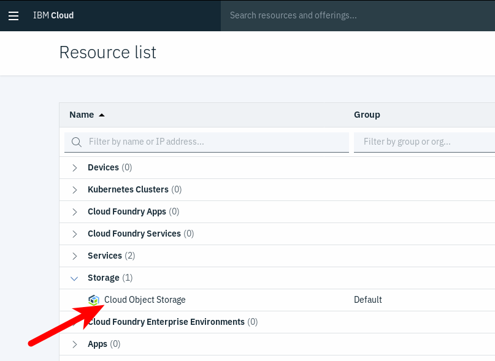

Create a bucket to store the data in by selecting **Create bucket**. Storing the data in a bucket makes it easier to locate when working with Watson Studio’s Neural Network Modeler.
You can name the bucket anything, but it must be globally unique to IBM Cloud Object Storage. Make sure that resiliency is set to **Cross Region** and location to **us-geo** before clicking **Create bucket**:

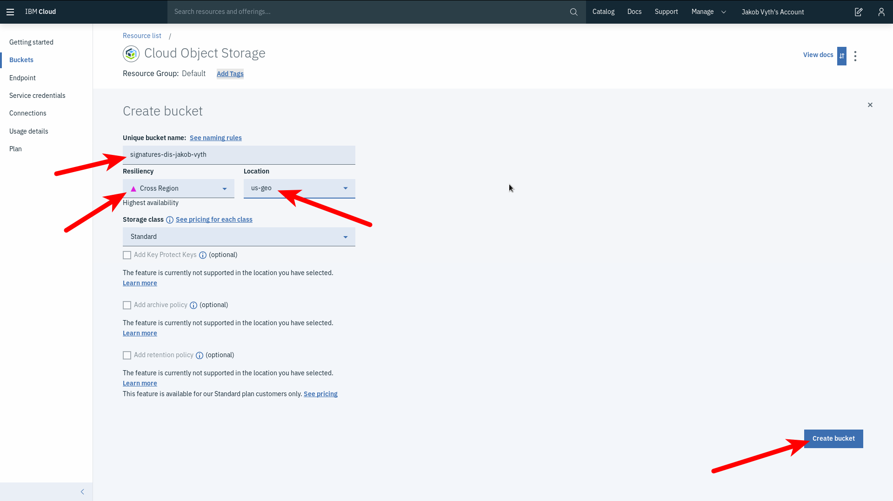

Start adding files to your newly created bucket by clicking the **Upload** button on the top right corner of the page and selecting the **Files** option from the drop-down menu.
Select **Standard Upload** and click **Select files**:

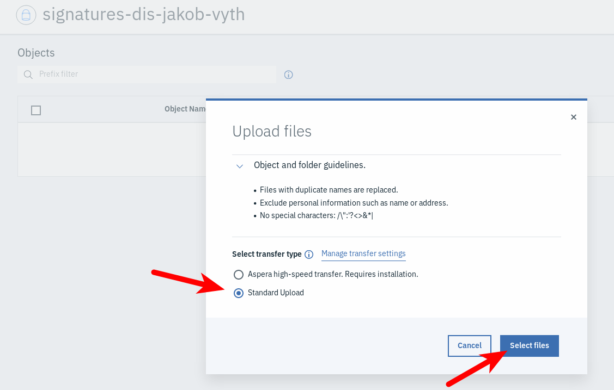

Choose the three files named **training_data.pickle**, **validation_data.pickle** and **test_data.pickle** from where you unzipped the assets folder before. You should be prompted to confirm the file selections. Click **Upload** to proceed. Now you should see the page displaying the files you just uploaded:

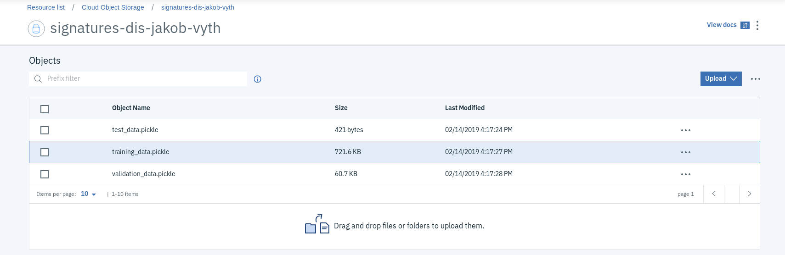

### Building a neural network using Watson Studio Neural Network Modeler
Go back to the dashboard and click on **Services** under the **Resource summary**. Then click on your **Watson Studio** instance:

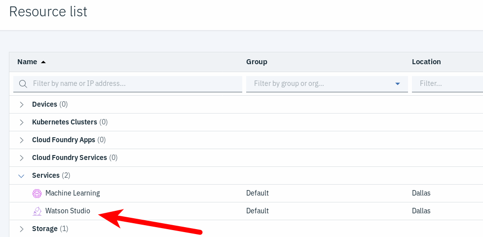

Next, click **Get Started** and then **Create a project**. Choose the **Standard** option:

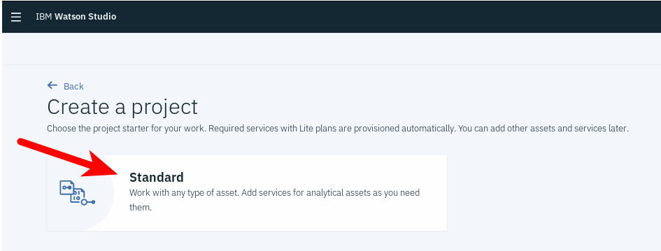

Give your project a name and make sure that your Cloud Object Storage instance shows up under **Storage** on the right side of the screen:

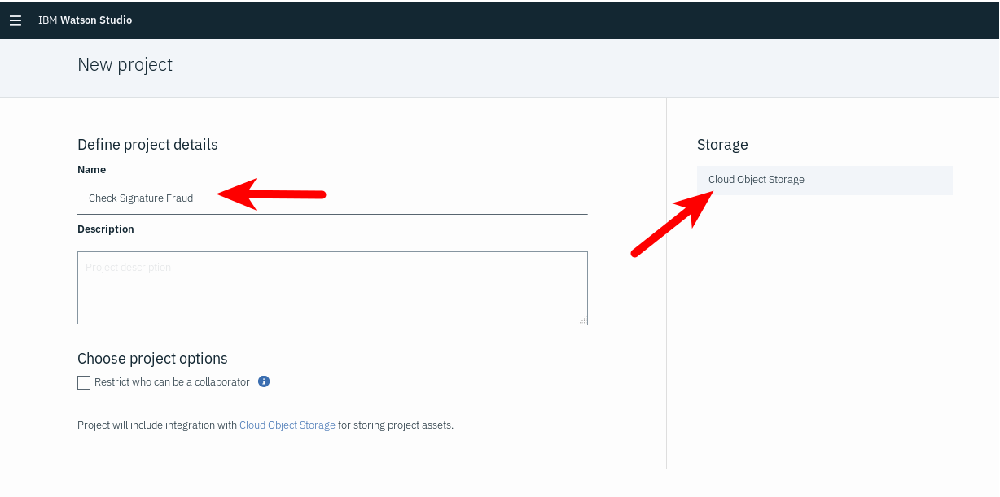

Click **Create** in the bottom right. You are now ready to work with Watson Studio!
Create a **Modeler Flow** by clicking **Add to project** and then selecting **Modeler Flow**:

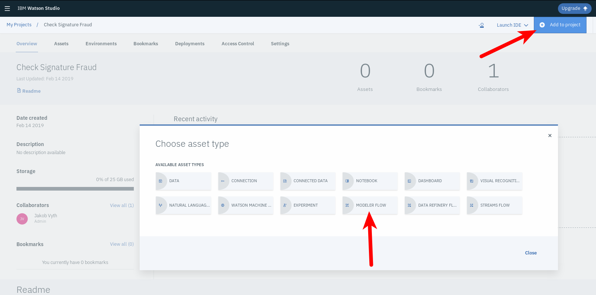

Give your model a name, select **Neural Network Modeler**, and click **Create**:

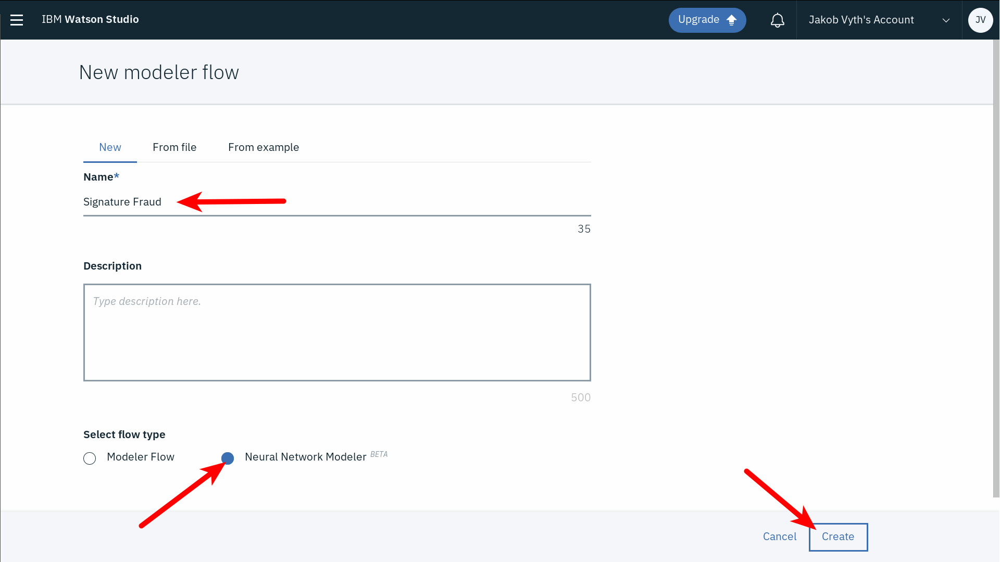

Once the previous step is successful, you will be presented with the Modeler Canvas. This is where you will build your Neural Network which will be represented in a graphical form instead of code. You will find a sidebar on the left of the screen containing all available neural network component, named **Palette**:

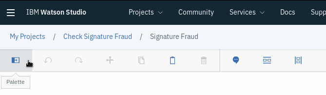

The whole idea here is to drag and drop nodes representing the different layers of a Neural Network and connecting them to create a **Flow**.

First, we need to provide our neural network with a way to access the data we uploaded earlier. To do this, select an **Image Data** node from the **Input** section of the **Palette** and drag it onto the flow canvas. Double-click the node to modify its properties. In order to define a data source, click **Create a connection** in the sidebar to the right:

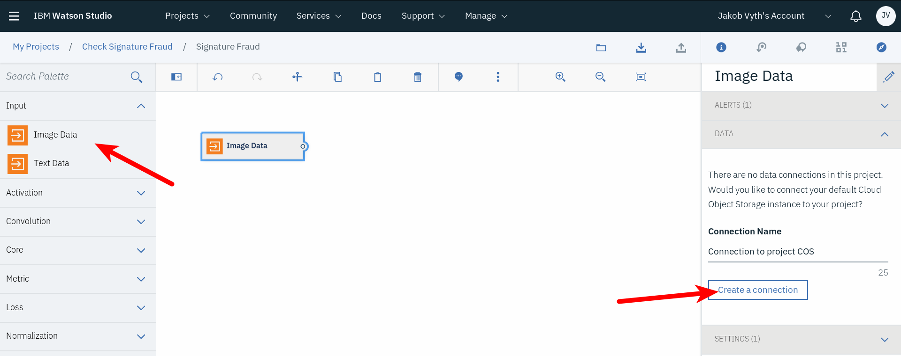

Choose the bucket that contains your data assets. Choose **training_data.pickle** as the **Train data file**, **test_data.pickle** as the **Test data file** and **validation_data.pickle** as the **Validation data file**:

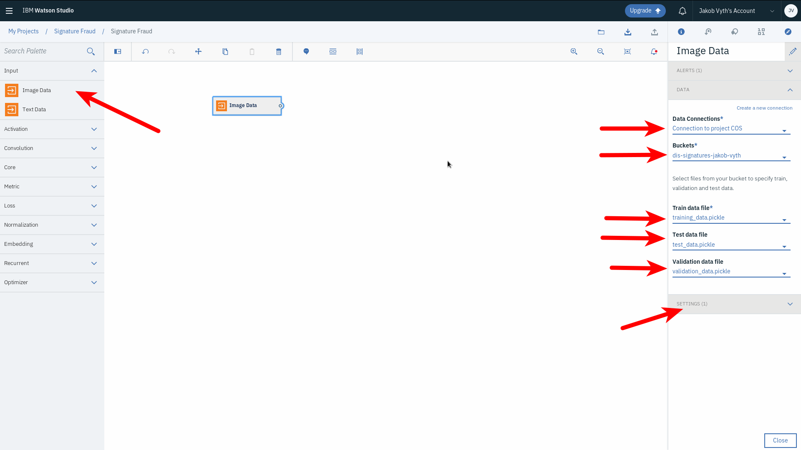

Now close the **Data** section and switch to the **Settings** section in the same right-side panel. Adjust all settings as described here and as shown in the screenshot below:
  - Set **Image height** to 32
  - Set **Image width** to 32
  - Set **Channels** to 1 since the images are in grayscale
  - Set **Tensor dimensionality** to channels_last
  - Set **Classes** to 2 since we are trying to classify signature images as either genuine or fraudulent
  - Set **Data format** as Python Pickle
  - Set **Epochs** to 100 (this is how many times the Neural Network will iterate over the data in order to learn more and adjust     weights to reach better accuracy)
  - Set **Batch size** to 16 (this is how many images will enter and go through the Neural Network at a time

Once you have all these settings in place, click **Close** to save them.

Now let us start building the neural network. The first layer we will add is a 2D Convolutional Layer. Select a **Conv 2D** node from the **Convolution** section in the left sidebar and drag and drop it onto the canvas.
Connect the two nodes by clicking on the small circle on the right side of the **Image Data** node and dragging it to the left side circle on the **Conv 2D** node. **Double-click** the **Conv 2D** node to edit its properties. In the right sidebar, change the settings to the following:
  - Set **Number of filters** to 32 (this is the number of feature maps we want to detect in a given image)
  - Set **Kernel row** to 3
  - Set **Kernel col** to 3
  - Set **Stride row** to 1
  - Set **String col** to 1

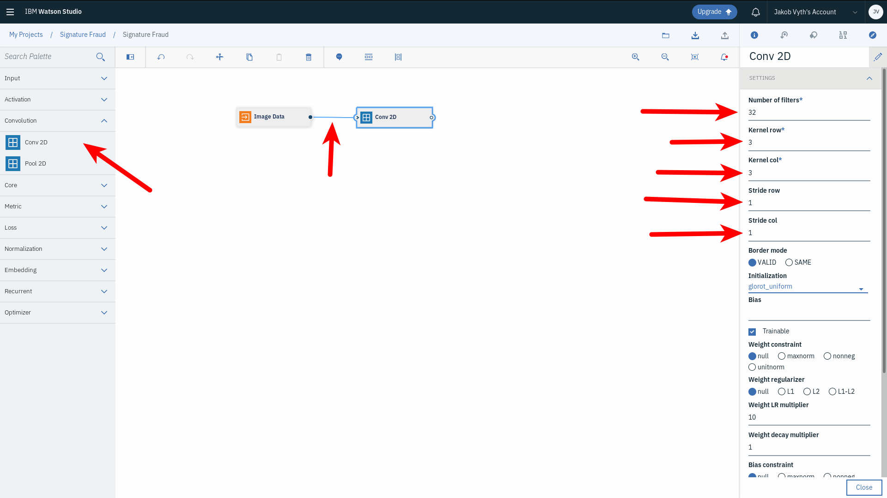

Continue editing the **Conv 2D** node properties:
  - Set **Weight LR multiplier** to 10
  - Set **Weight decay multiplier** to 1
  - Set **Bias LR multiplier** to 10
  - Set **Bias decay multiplier** to 1

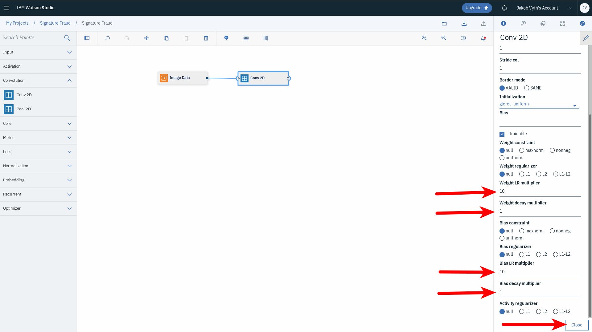

We only edited the required parameters here. There are other optional parameters that have default settings, such as Initialization, which is the initial weights values. You can set an initial Bias value and set whether it is trainable or not. You can choose a regularization method to minimize overfitting and enhance model generalization. This is a way to penalize large weights and focus on learning small ones as they are lower in complexity and provide better explanation for the data; thus, better generalization for the model.

Once you have all the required settings in place, click **Close** to save them.
Next we will add the third node, which is an activation layer. We will choose **ReLU** (Rectified Linear Unit) as the activation function in our architecture. **ReLU** gives good results generally and is widely used in Convolutional Neural Networks.
Drag a **ReLU** node from the **Activation** section in the **Palette** and drop it onto the canvas. Make sure you are connecting each node to the previous as you create them:

Then, add another **Conv 2D** layer from the **Convolution** section. Edit its properties as follows:
  - Set **Number of filters** to 64
  - Set **Kernel row** to 3
  - Set **Kernel col** to 3
  - Set **Stride row** to 1
  - Set **Stride col** to 1
  - Set **Weight LR multiplier** to 1
  - Set **Weight decay multiplier** to 1
  - Set **Bias LR multiplier** to 1
  - Set **Bias decay multiplier** to 1

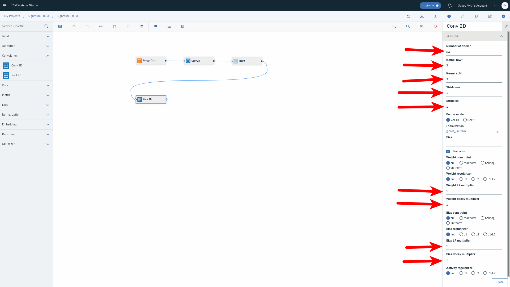

Save these settings by clicking **Close**. Add another **ReLU** node from the **Activation** section.
Now, we will add a Max Pooling layer, with the purpose of down-sampling or reducing the dimensionality of the features extracted from the previous convolutional layer. This is achieved by taking the maximum value within specific regions (windows) that will slide across the previous layer’s output. This step helps aggregate many low-level features, extracting only the most dominant ones thus reducing the amount of data to be processed.

Drag and drop a **Pool 2D** node from the **Convolutional** section in the sidebar. **Double-click** it and change its settings:
  - Set **Kernel row** to 2
  - Set **Kernel col** to 2
  - Set **Stride row** to 1
  - Set **Stride col** to 1

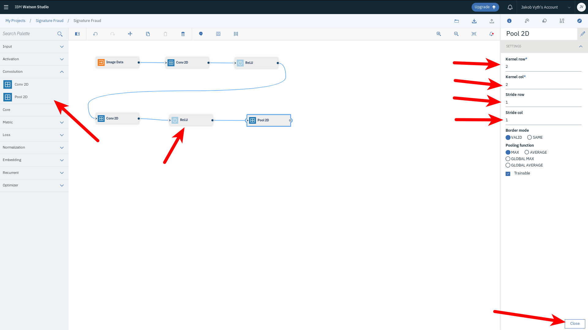

Next up is a Dropout layer. The purpose of this layer is to help reduce overfitting, mainly by dropping or ignoring some neurons in the network randomly. Drag and drop a **Dropout** node from the **Core** section. **Double-click** it, change **Probability** to 0.25, and click **Close**.

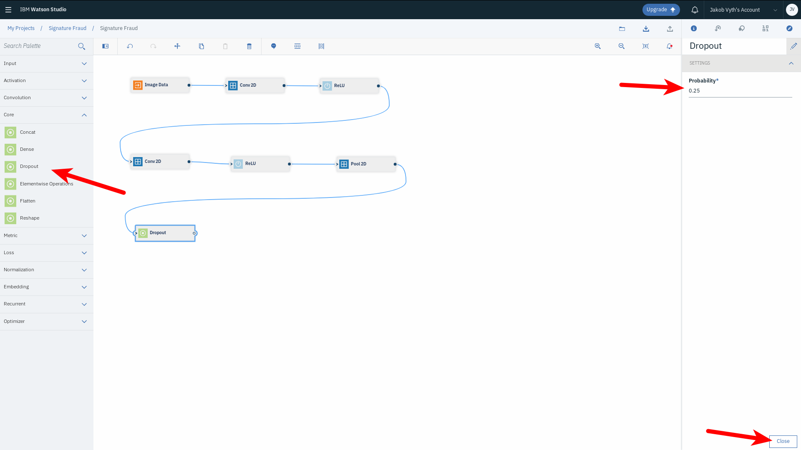

It is time to move on the to the fully connected layers! To do that, we need to flatten the output we have up until now into a 1D matrix.
Drag and drop a **Flatten** node from the **Core** section. Also drag and drop a **Dense** node from the **Core** section. **Double-click** the **Dense** node and change **\#nodes** to 128. Click **Close**.

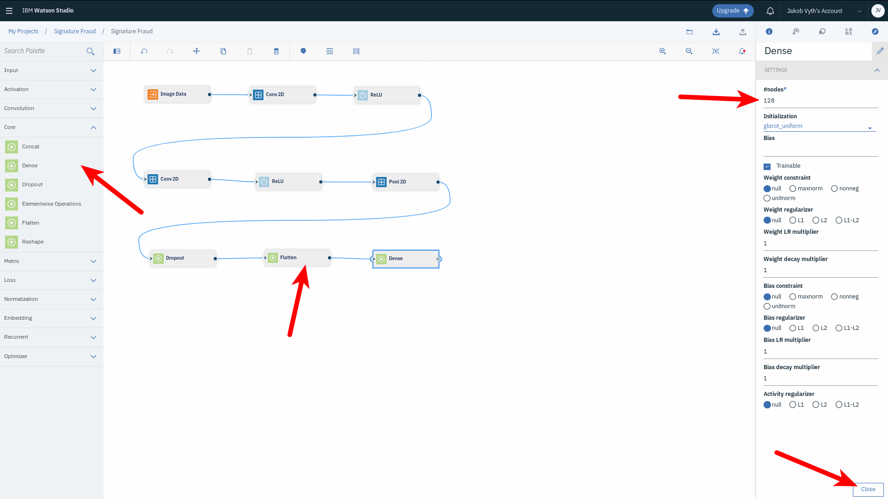

Add another **Dropout** node from the **Core** section and change its **Probability** to 0.5. Click **Close**.
Add a final **Dense** node. This will represent the output classes (two in this case). **Double-click** the node and change  **\#nodes** to 2 and click **Close**.

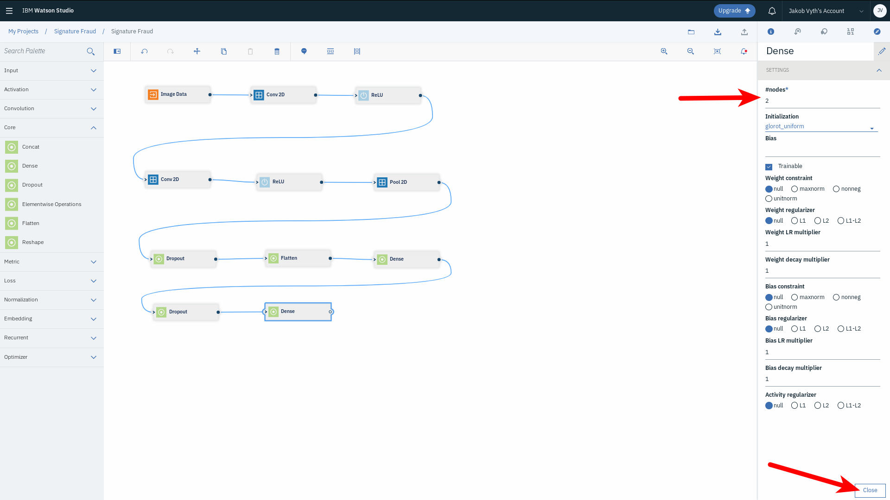

Now, let us add an activation layer at the end of our architecture. We will use **Softmax** here. It returns an output in the range of \[0, 1\] to represent true and false values for each node in the final layer.

Drag and drop a **Softmax** node from the **Activation** section.

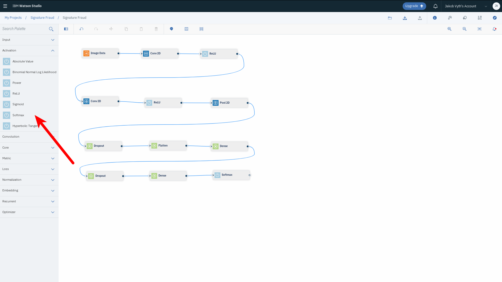

We will need to add some means of calculating the performance of the model. This is represented in the form of a cost function, which calculates the error of the model\'s predicted outputs in comparison to the actual labels in the dataset. Our goal is to minimize the loss as much as possible. The function we will use is Cross-Entropy. We will also add another node to calculate the accuracy of our model’s predictions.

Drag and drop a **Cross-Entropy** node from the **Loss** section, and an **Accuracy** node from the **Metrics** section. Connect them both to the **Softmax** node:

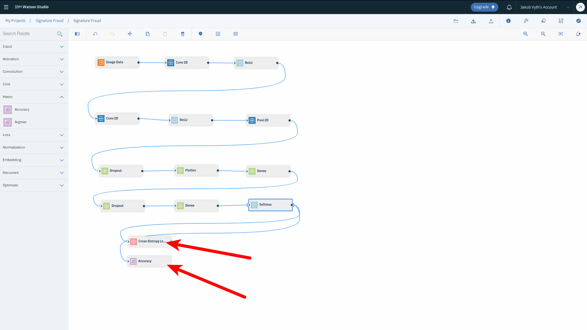

Finally, we will add an optimization algorithm which defines how the model will fine tune its parameters to minimize loss. There are many such algorithms, but we will use an Adam optimizer as it is a generally well-functioning optimization algorithm.
Drag and drop an **Adam** node from the **Optimizer** section. **Double-click** it and change its settings:
  - Set the **Learning rate** to 0.001
  - Set the **Decay** to 0 (with an Adam optimizer, we do not need to set this value as Adam does not make use of it)

Connect the **Adam** node to the **Cross-Entropy** node:

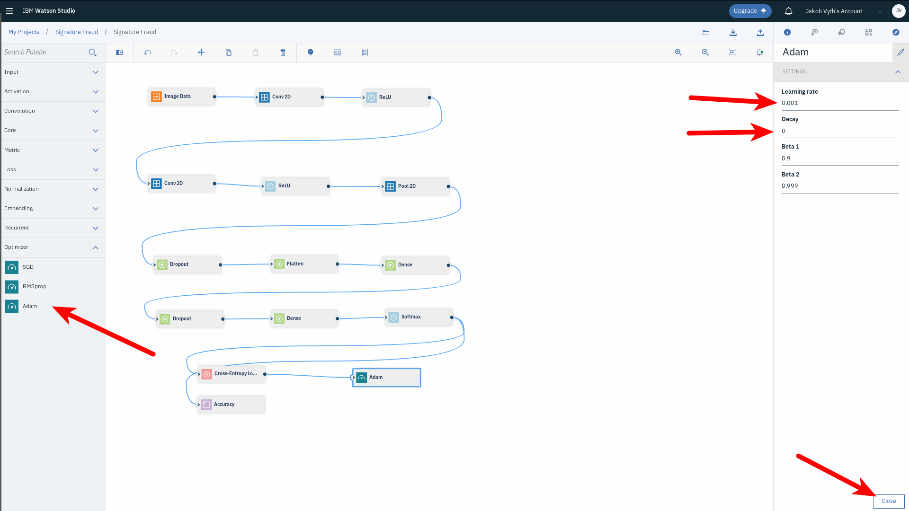

### Publishing a model from Neural Network Modeler and training it using Experiments
Now that we have the full architecture of our Neural Network, let us start training it and see how it performs on our dataset. You can do that directly from Watson Studio’s Neural Network Modeler’s interface.
In the top toolbar, select the **Publish training definition** tab and click it:

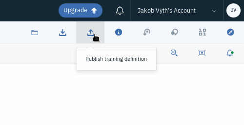

Name your model so you can identify it later. You will need to have a **Watson Machine Learning Service** associated to your project. If one is not associated already, you will be prompted to do that on the fly. In the given prompt, click the **Settings** link:

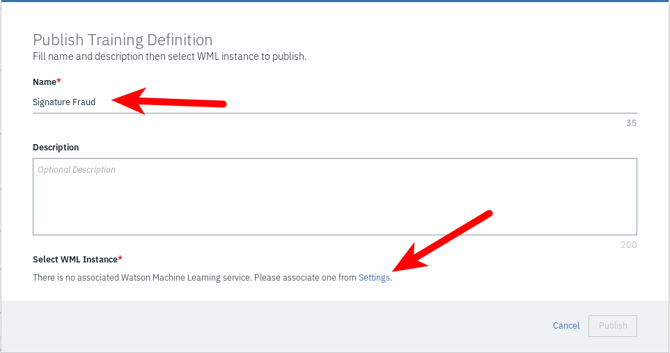

You will be redirected to the project settings page. Here you can manage all services and settings related to your current project. Scroll down to the **Associated Services** section, click **Add service** and select **Watson** from the drop-down menu:

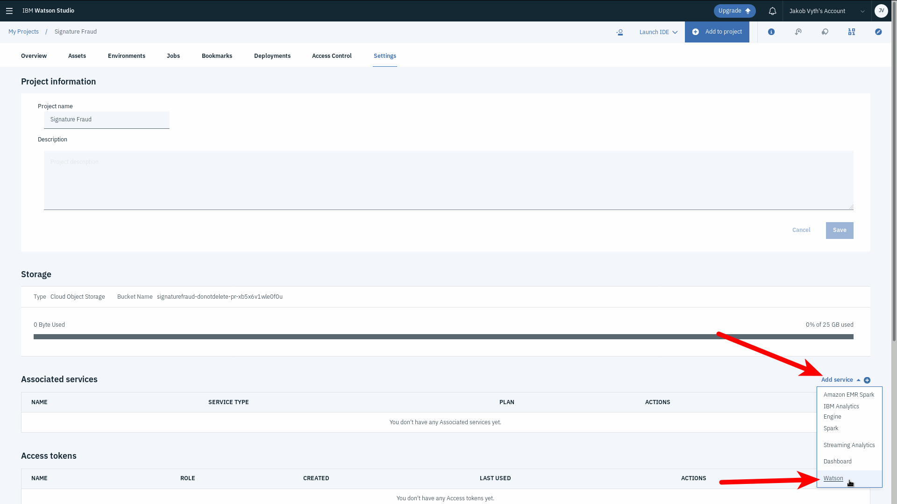

You will then be presented with all available Watson services. Choose **Machine Learning** and click **Add**.
Select your **Machine Learning service instance** and click **Select**:

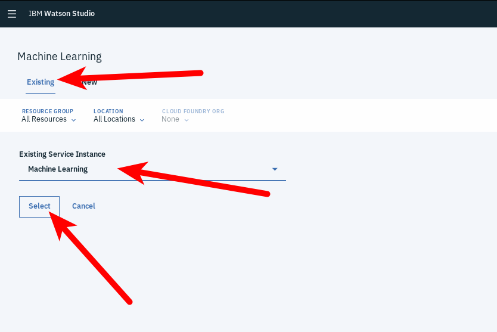

This will redirect you back to the project settings page. Click on **Assets** and scroll down to the **Modeler flows** section. Click on the flow we have been working on.

Once your flow loads, again click on the **Publish training definition** tab. Make sure that your model is named and that the Machine Learning service is detected and selected, then click **Publish**:

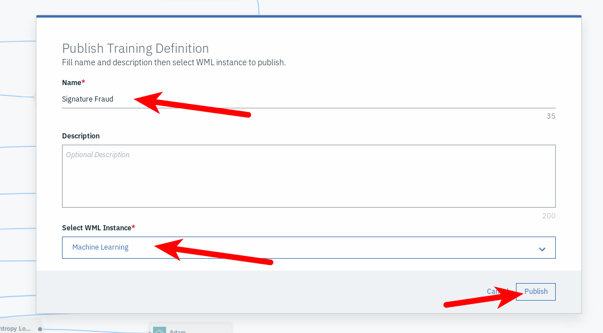

When the training definition has been published, you will find a notification at the top of the screen showing you a link to train the model in **Experiments**. Click it:

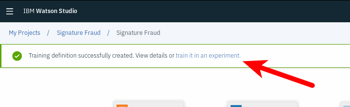

We will now create a new **Experiment**. Start by giving it a name, then select the **Machine Learning service**. Lastly, we need to define the source of our data and where we will store the training results.
Choose the bucket containing your dataset by clicking **Select**:

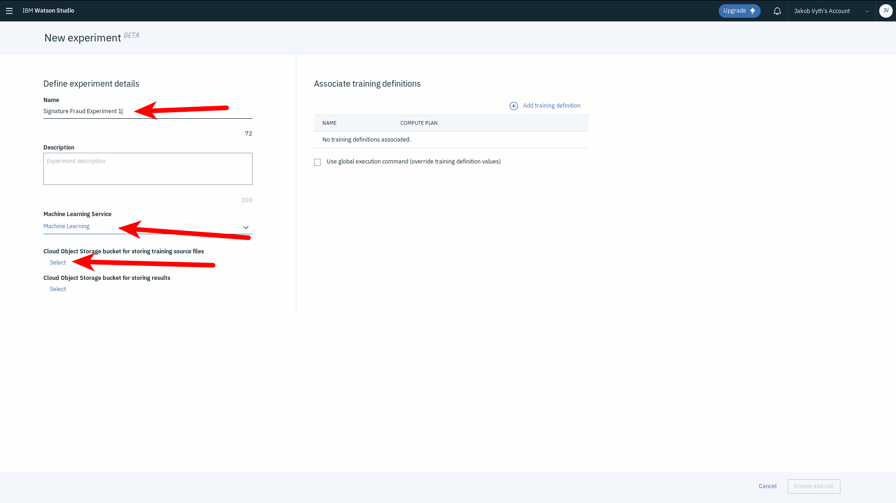

From the drop-down menu, choose your already existing **Object Storage connection**:

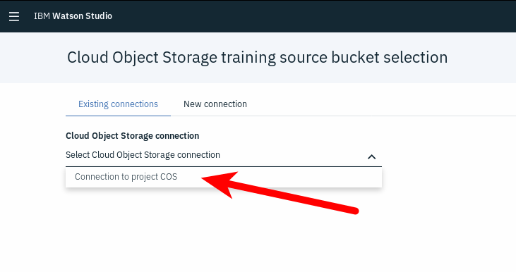

Choose the correct bucket by marking the **Existing radio button** and selecting the name of the bucket where you saved the dataset. Click the **Select** button at the bottom of the page:

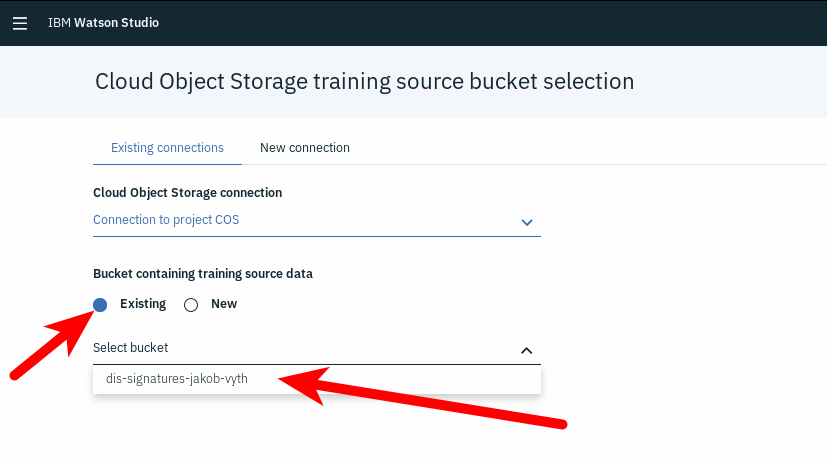

You will be redirected back to the **new Experiment form** to choose where to store your training results. Click **Select**:

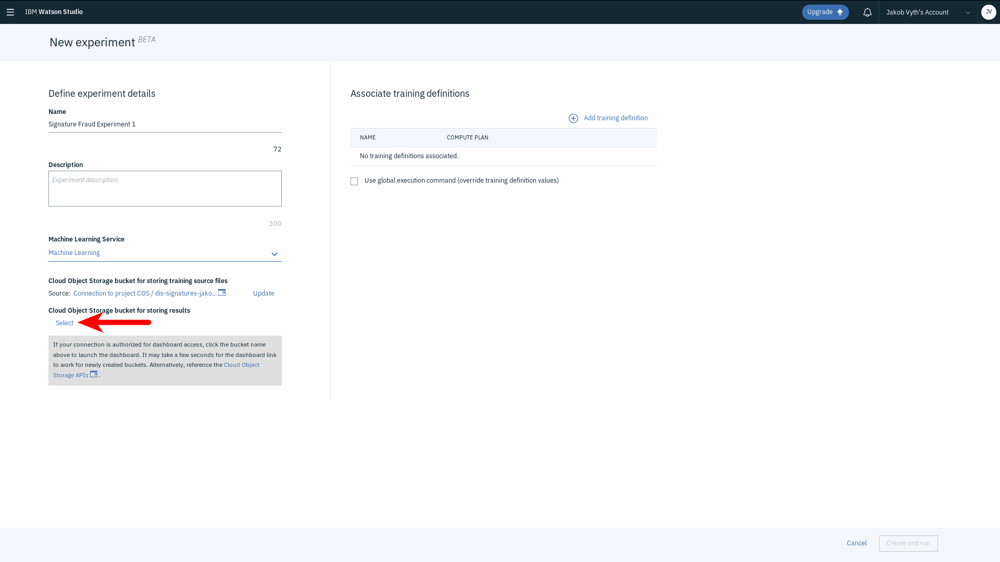

Like before, choose **Existing connection** and select your **Object Storage connection** from the drop-down. Now, however, mark the **New** radio button and give your new results bucket a name (remember that buckets must have globally unique names!):

Click **Select** to return the the **new Experiment form**. Click **Add training definition**:

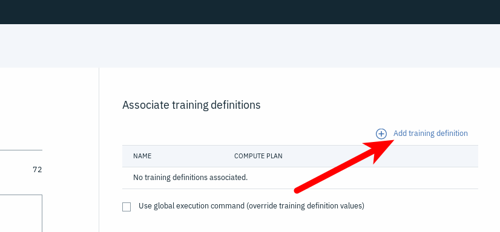

Since we already published a training definition from Neural Network Modeler, we will select the **Existing training definition** option:

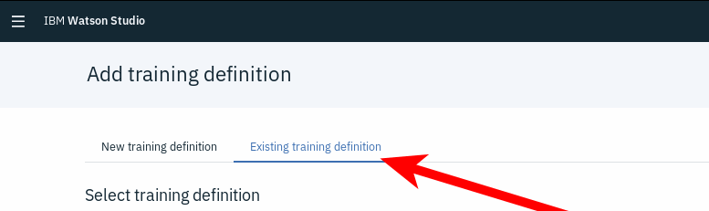

From the drop-down, select the training definition we created:

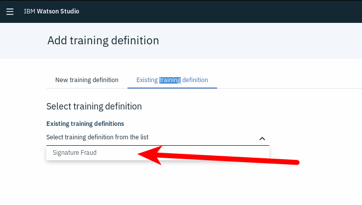

Now we have to select the hardware that will be used to train the model. Choose **1/2 x NVIDIA Tesla K80 (1 GPU)** from the drop-down (should be the first option). For the **Hyperparameter Optimization Method**, select **None**:

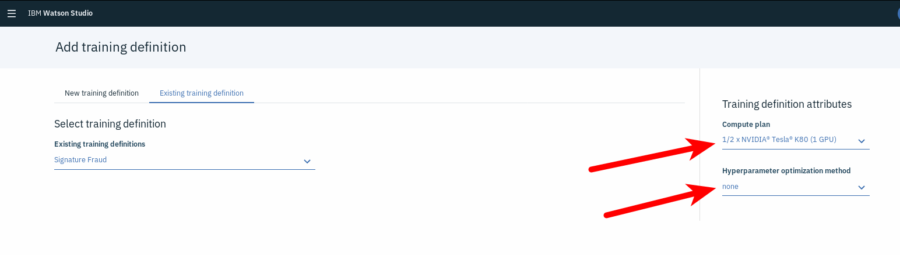

Finally, click **Select** in the bottom right corner.
Back to the **new Experiment form** for the last time. At this point, everything should be set. Click **Create and run** at the bottom of the page to start training your model!

You will be presented with a view with details about the process. Once your model is trained (should take a couple of minutes), it will be listed in the **Completed** section at the bottom of the page.

Click the **three vertical dots** under the **Actions** tab and select **Save Model**:

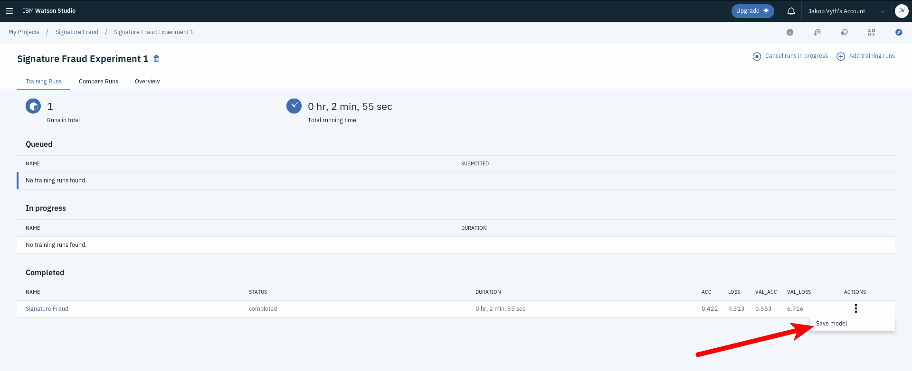

Give your model a name, save it, then make your way back to the project dashboard by clicking on your project name:

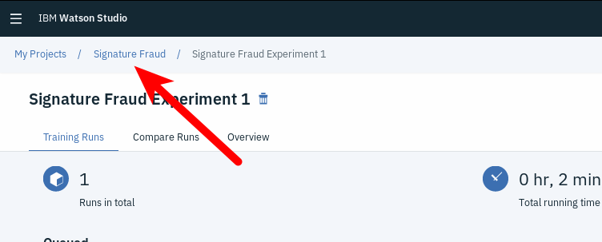

Under **Models**, click on the model you just saved and navigate to the **Deployments** tab. Click **Add Deployment**:

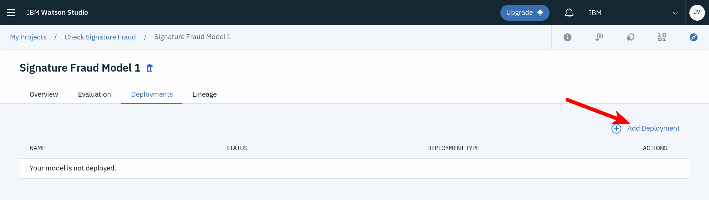

Give your deployed model a name, make sure the **Web service radio button** is marked, and click **Save**:

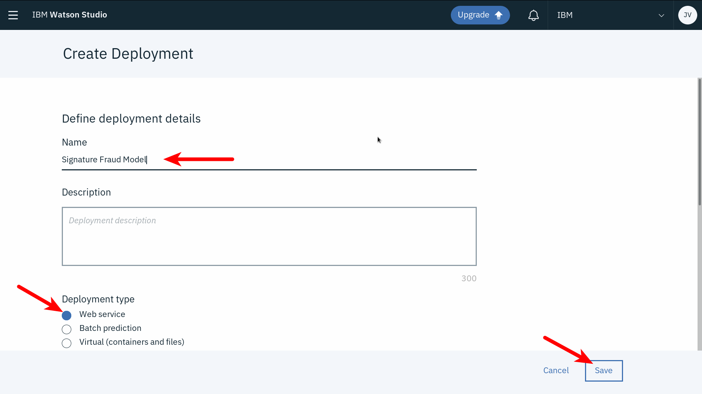

The STATUS field will tell you when the model has been successfully deployed:

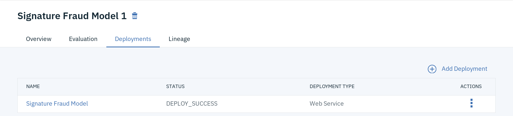

Your model is now ready to score images via API calls!

### Calling your model using the Watson Machine Learning Python SDK

**IMPORTANT: If you were unable to install the Watson Machine Learning Python SDK, skip this step**

Now it is time to calling your model's API and letting it score an image of a signature! The signature we will score is this one:

The reason that it is blurred like it is, is that it has to be normalized before it can be scored by the neural network model.

First, examine the python file that was included in the zipped assets by opening **evaluate.py** using your favorite text editor. This file contains (almost) everything needed to call your model\'s API:

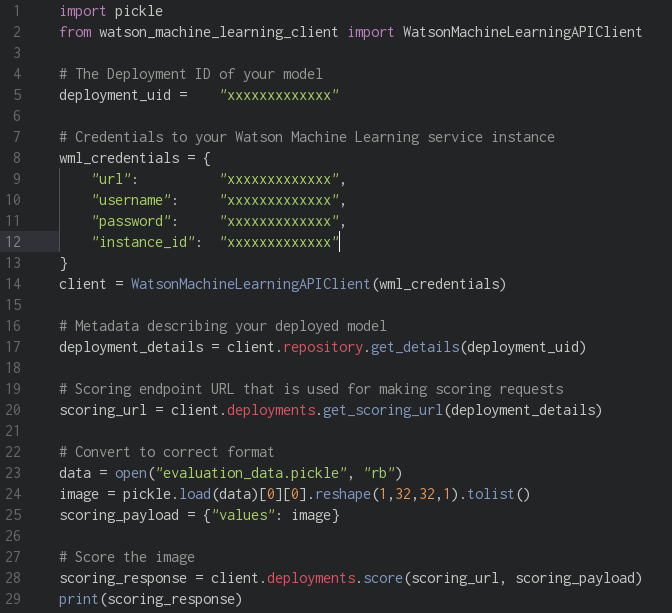

As you can see, the values for **deployment_id**, **url**, **username**, **password**, and **instance_id are missing**! Before we can call the model, we need to gather these bits of data.
First up: deployment_id. Go to your project dashboard and click the **Deployments** tab, then click on your deployed model:

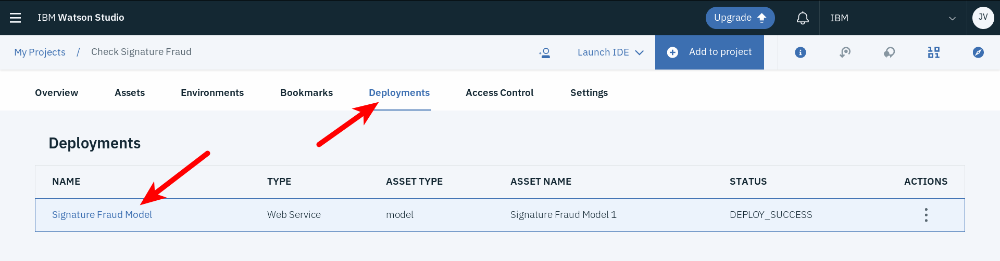

**deployment_id** should be right there. Copy and paste it inside the string literals in the evaluate.py file.

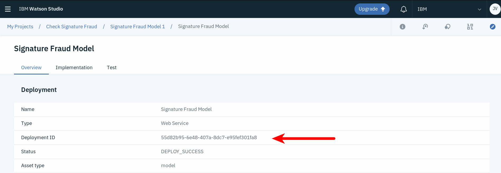

Next up: the rest. **url**, **username**, **password**, and **instance_id** are all used to identify yourself when calling the API. In order to find them, you must go to the main **IBM Cloud dashboard** and find your **Machine Learning service instance**:

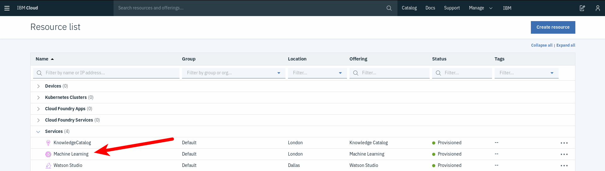

Click it and navigate to the **Service credentials** tab. Click **New credential**:

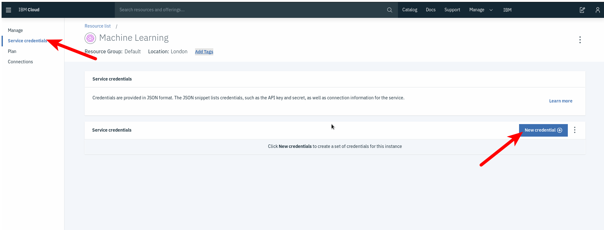

Leave everything as-is and click **Add**.

Access your newly made credentials by clicking **View credentials** under the **Action** field. This is where we can find the information we need!

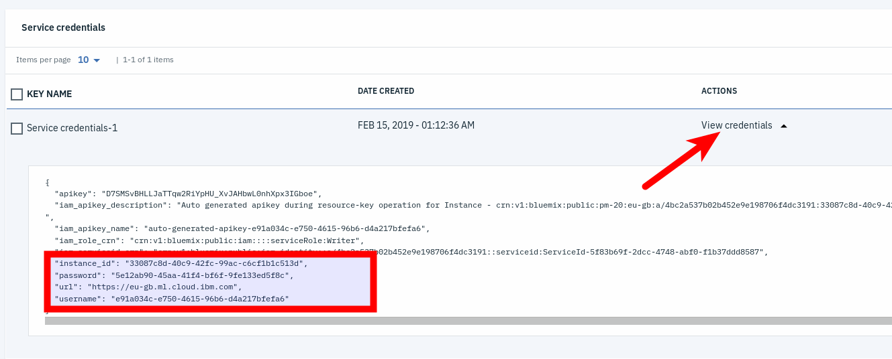

Copy the values of **url**, **username**, **password**, and **instance_id** into the correct places in evaluate.py. The end result should look very similar to this:

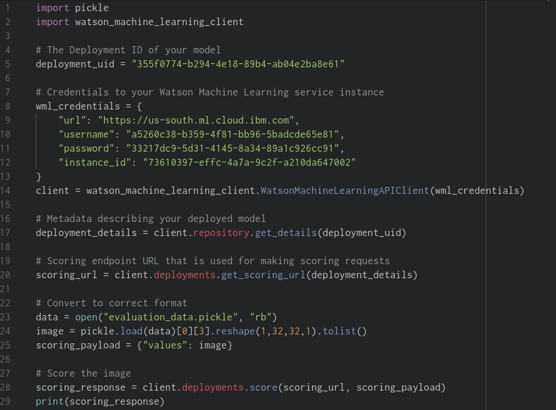

You are now ready to run the file and let you model score an image! Using whatever tool you want, run the evaluate.py file. You should get a printout looking like this:

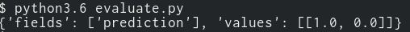

### Summary
In this tutorial, you learned about the powerful deep learning tools available in Watson Studio. You learned how to quickly prototype a neural network architecture using the Neural Network Modeler. You learned how to publish the Neural Network Flow and train it using Experiments. You also learned how to deploy your model and how to call its API to let it score an image using the Watson Machine Learning Python SDK.

#### Well done!
